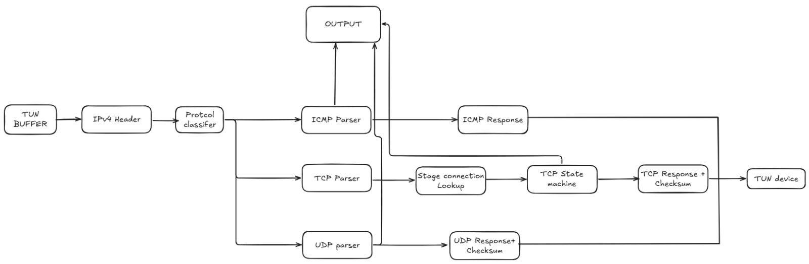
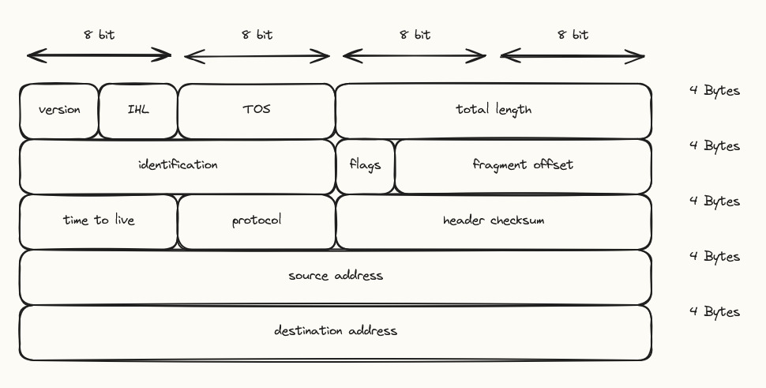
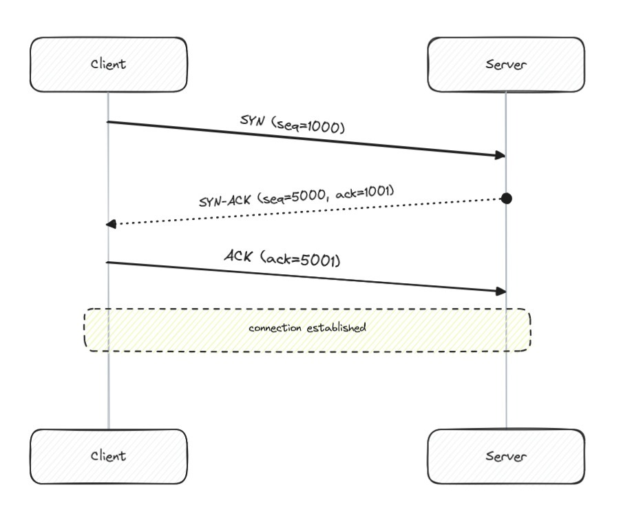
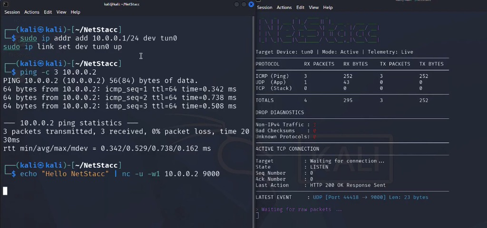

# Tilde 5.0 Netstacc: A Custom TCP/IP Network Stack

Written By [Team Netstacc](https://github.com/homebrew-ec-foss/Netstacc)

Tilde 5.0 | 8 min read

<br>

**Mentees:**
- Aishwarya ([@itsmeAishwarya](https://github.com/itsmeAishwarya))
- Vansh ([@Vanshdev3](https://github.com/Vanshdev3))
- Visruth ([@visruth](https://github.com/visruth))

**Mentors:**
- Mahilan Suki
- Sarah
- SelvaGanesh
- Shashi

---

<br>

### What Netstacc is

Every time you `ping` something, open a website, or send a text, your computer chops the data into packets, wraps each one in a few layers of headers, and hands it off to a stack of protocols — IP, ICMP, UDP, TCP — to get it there. Normally the OS handles all of this before your own code ever sees a packet.

Netstacc replaces that with a TCP/IP stack written from scratch in C, running entirely outside the Linux kernel's networking code. It reads raw packets off a TUN device, parses IPv4 headers byte by byte, replies to pings, validates UDP checksums, runs a full TCP handshake, and exposes all of it through a live dashboard — so instead of taking the kernel's word for it, you get to watch your own packets move.

<br>


> *The full pipeline. Everything downstream of "protocol classifier" is handled by a dedicated parser per protocol.*

<br>

---

<br>

### Getting packets into userspace: the TUN device

The OS's network stack normally intercepts incoming packets before any user program sees them. To make our own code the network stack instead, we needed a TUN interface — a virtual network device that looks like a real NIC to the rest of the OS, but hands every packet straight to whichever program opened it.

```c
int tun_alloc(char *dev) {
    struct ifreq ifr;
    int fd = open("/dev/net/tun", O_RDWR);

    memset(&ifr, 0, sizeof(ifr));
    ifr.ifr_flags = IFF_TUN | IFF_NO_PI;
    strncpy(ifr.ifr_name, dev, IFNAMSIZ);

    ioctl(fd, TUNSETIFF, (void *) &ifr);
    return fd;
}
```

`IFF_TUN` returns raw IP packets instead of full network frames; `IFF_NO_PI` strips an extra info header we don't need. Once `tun0` is up, any packet routed to it lands directly in our buffer via `read()` — no kernel networking code involved from that point on. A completely ordinary `ping` from another terminal is enough to prove it: those bytes are now ours to do whatever we want with.

<br>


> *Kernel space hands off to userspace at exactly one point: the `read()` call. Everything after that line is ours.*

<br>

**Try it yourself:** with `tun0` up and addressed (`sudo ip addr add 10.0.0.1/24 dev tun0`, `sudo ip link set dev tun0 up`), run `ping -c 3 10.0.0.2` from another terminal and watch the raw packets show up on the Netstacc side.

<br>

---

<br>

### Parsing IPv4 and replying to ICMP

Once a packet lands, we cast the raw buffer onto a struct matching the IPv4 header layout — version, IHL, TOS, total length, then identification/flags/fragment offset, then TTL/protocol/checksum, then source and destination addresses.

```c
void classify_protocol(struct ipv4_header *ip, uint8_t *buf, int tun_fd) {
    int header_len = (ip->version_ihl & 0x0f) * 4;
    uint8_t *payload = buf + header_len;

    switch (ip->protocol) {
        case IPPROTO_ICMP: handle_icmp(ip, buf, tun_fd); break;
        case IPPROTO_TCP:  handle_tcp(ip, payload, ntohs(ip->total_length) - header_len); break;
        case IPPROTO_UDP:  handle_udp(ip, payload, ntohs(ip->total_length) - header_len); break;
    }
}
```

One detail worth flagging: the IHL field stores header length in 32-bit *words*, not bytes. Miss the `× 4` and every field after it reads as garbage — not an error, just wrong numbers that happen to look plausible enough to fool you for a bit. Checksum verification (per RFC 1071) only means anything once the header length is computed correctly.

`handle_icmp` is where the reply actually gets built: flip the ICMP type from 8 to 0, recompute the checksum, and write it back out through `tun0`.

<br>


> *Every field here maps directly to a struct field in `classify_protocol`.*

<br>

---

<br>

### UDP and the pseudo-header checksum

UDP is connectionless — no handshake, no acknowledgment. But its checksum still requires a pseudo-header: source IP, destination IP, and the protocol number, assembled purely for the checksum calculation, even though none of it is actually transmitted as part of the packet.

```c
uint16_t compute_udp_checksum(struct ipv4_header *ip, struct udp_header *udp, int len) {
    struct udp_pseudo_header pseudo;
    pseudo.src_ip = ip->src_ip;
    pseudo.dest_ip = ip->dest_ip;
    pseudo.protocol = IPPROTO_UDP;
    pseudo.udp_length = htons(len);

    int total_len = sizeof(pseudo) + len;
    uint8_t *buf = malloc(total_len);
    memcpy(buf, &pseudo, sizeof(pseudo));
    memcpy(buf + sizeof(pseudo), udp, len);

    uint16_t result = compute_checksum(buf, total_len);
    free(buf);
    return result;
}
```

A wrong checksum here produces no error — the packet just vanishes, and the classifier looks like it's doing nothing at all, which is its own special kind of debugging fun. UDP uses the same `compute_checksum()` as ICMP and TCP, kept in a single `checksum.c` on purpose, so the three protocols share one implementation instead of quietly drifting apart.

<br>


> *The pseudo-header exists only for this one calculation — it's never actually sent.*

<br>

**Mini challenge:** send `echo "Hello Netstacc" | nc -u -w1 10.0.0.2 9000` at a stack like this and check what the dashboard logs — packet length, source port, whether the checksum passed. A good way to see a protocol that has almost no visible behavior otherwise.

<br>

---

<br>

### TCP: connection state and the handshake

Everything above is stateless — read a packet, respond, move on. TCP breaks that pattern: it has to track exactly where a connection stands across every packet exchanged, starting with the three-way handshake: SYN, then SYN-ACK, then ACK, before a connection counts as ESTABLISHED.

This required a state machine (`LISTEN → SYN_RCVD → ESTABLISHED`) backed by a Transmission Control Block (TCB) per connection, holding the current sequence number, the expected acknowledgment number, and the receive window. The implementation follows RFC 793 and RFC 9293 — closely, because there's no partial credit here. An incorrect state transition doesn't throw an error. It desyncs the connection silently, and the only sign is a packet capture that quietly stops matching what the TCB expects.

The handshake itself: the client sends `SYN(seq=1000)`, the server responds with `SYN-ACK(seq=5000, ack=1001)`, and the client closes it out with `ACK(ack=5001)`. Each number has to line up exactly with what the TCB is tracking, or the connection never reaches ESTABLISHED.

<br>


> *Three messages, and a state machine that has to track every one of them correctly.*

<br>

---

<br>

### Reliable delivery: retransmission and teardown

A completed handshake isn't the finish line — TCP also has to guarantee that data arrives, and arrives correctly. That means acknowledging received packets, detecting when something needs to be resent, and tearing the connection down cleanly at the end.

We track whether a sent packet is acknowledged within a window; if not, it's treated as lost and retransmitted — a simplified version of the same mechanism real TCP stacks use. The main design constraint is distinguishing packets that arrived but whose ACK was delayed from packets that genuinely need resending — conflating the two breaks reliability. Closing a connection has its own smaller state machine: both sides have to agree the connection is over before either can stop sending.

This is the part the dashboard earns its keep on — point it at a live connection, drop packets on one side on purpose, and watch a retransmission happen in real time. A good way to check the logic is actually correct, not just plausible-looking.

<br>

---

<br>

### The dashboard: two views, one struct

With the stack producing real metrics — packets per protocol, drops, bad checksums — scrolling logs weren't useful anymore. The dashboard ended up as two views reading off the same `live_stats` struct: one rendered to the terminal, and one served as a web dashboard over HTTP.

The terminal side repaints in place — clear the screen, move the cursor home, redraw the table:

```c
void render_dashboard() {
    printf("\033[H"); // Move cursor to top left

    time_t now = time(NULL);
    long uptime = (long)difftime(now, live_stats.start_time);
    int hrs = uptime / 3600;
    int mins = (uptime % 3600) / 60;
    int secs = uptime % 60;
    long rate = (uptime > 0) ? (live_stats.total_rx_packets / uptime) : live_stats.total_rx_packets;

    printf("  Target Device: %stun0%s | Uptime: %02d:%02d:%02d | Rate: %ld pkts/s\n",
           C_WHITE, C_RESET, hrs, mins, secs, rate);

    printf("  PROTOCOL         RX PACKETS   RX BYTES    TX PACKETS   TX BYTES\n");
    printf("  ICMP (Ping)      %-13lu %-11lu %-13lu %-10lu\n",
           live_stats.icmp.rx_packets, live_stats.icmp.rx_bytes,
           live_stats.icmp.tx_packets, live_stats.icmp.tx_bytes);
    printf("  UDP (App)        %-13lu %-11lu %-13lu %-10lu\n",
           live_stats.udp.rx_packets, live_stats.udp.rx_bytes,
           live_stats.udp.tx_packets, live_stats.udp.tx_bytes);
    printf("  TCP (Stack)      %-13lu %-11lu %-13lu %-10lu\n",
           live_stats.tcp.rx_packets, live_stats.tcp.rx_bytes,
           live_stats.tcp.tx_packets, live_stats.tcp.tx_bytes);

    printf("  Non-IPv4 Traffic : %s%lu%s\n", C_RED, live_stats.drops.non_ipv4, C_RESET);
    printf("  Bad Checksums    : %s%lu%s\n", C_RED, live_stats.drops.bad_checksum, C_RESET);
    printf("  Unknown Protocols: %s%lu%s\n", C_RED, live_stats.drops.unknown_proto, C_RESET);
}
```

No ncurses, no framework — just ANSI escape codes (`\033[2J\033[H` to clear and reset the cursor) and a struct read fresh on every redraw.

This is the part that surprised us most once it was working end to end: the browser view of the dashboard isn't served by a separate HTTP server. It's `handle_tcp()` recognizing its own payload! 

Once a connection reaches `ESTABLISHED` and a segment's payload starts with `"GET "`, the classifier builds a full HTML page in memory — the same ASCII banner as the terminal, a stats table pulled from its own tallies, and a `<meta http-equiv="refresh" content="2">` tag so the browser tab redraws itself every two seconds.

No JSON, no separate thread, no framework — the "web dashboard" is a raw HTTP/1.1 response, hand-assembled and checksummed, sent back over a TCP connection that Netstacc's own state machine negotiated a moment earlier. Because it's serving plain HTML, you can navigate to `http://10.0.0.1:8080` in any web browser to see the live dashboard, or run `curl -v http://10.0.0.1:8080` from the terminal to see the exact same HTML response come back over the wire.

<br>


<br>


> *Per-protocol counts, drop diagnostics, and the live state of the current TCP connection, updating in real time.*

<br>

Beyond raw counts, the dashboard tracks per-connection state and flags retransmitted or dropped packets as they happen. Here it is running against the commands that generate the traffic — bringing `tun0` up, then a plain `ping` and a raw UDP packet via `nc`:

<br>


> *Left: the terminal view, redrawing from `live_stats`. Right: the browser view hitting the same struct over HTTP.*

<br>

---

<br>

### Stress testing and what's next

Flooding the stack with Netcat and ping floods, non-IPv4 traffic gets dropped instantly. Neither dashboard view stalls — the terminal keeps redrawing and the browser keeps answering requests, which is the point of running the HTTP server directly in the packet loop.

What's left on the roadmap: replacing the TUN device with direct ARP and raw Ethernet frame handling; proper TCP congestion control instead of the current fixed retransmission behavior; and application-layer work on top of the stack — minimal HTTP/1.1 parsing, a basic DNS resolver, IP fragmentation and reassembly, IPv6 support, and eventually SSL/TLS.

<br>

---

<br>

### Why this matters outside the project

The bugs in a project like this map directly onto failures people run into every day. A dropped UDP packet from a bad checksum is the same failure class behind a game that loses inputs or a call that stutters. A TCP sequence number that's slightly wrong is the same class of bug behind an app stuck "loading" or a payment stuck between "sent" and "confirmed," with no error message explaining why.

Building a TCP/IP stack from scratch turns these protocols from textbook diagrams into something you debug directly — every checksum and every state transition is something you're responsible for getting right. A `ping` looks a lot less boring once you've had to make one succeed yourself.

<br>

## References & Resources
- [Netstacc Repository](https://github.com/homebrew-ec-foss/Netstacc)
- [RFC 791 - Internet Protocol](https://datatracker.ietf.org/doc/html/rfc791)
- [RFC 793 / 9293 - Transmission Control Protocol](https://datatracker.ietf.org/doc/html/rfc9293)
- [Linux TUN/TAP Documentation](https://www.kernel.org/doc/Documentation/networking/tuntap.txt)

#c #systems #networking #tcpip #homebrew #tilde5.0
